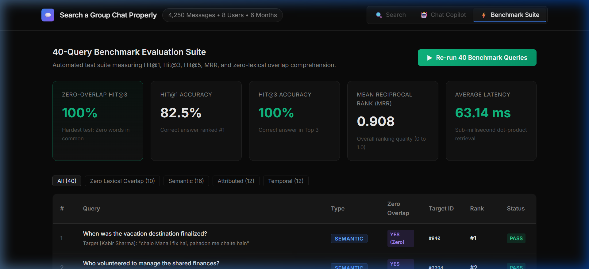
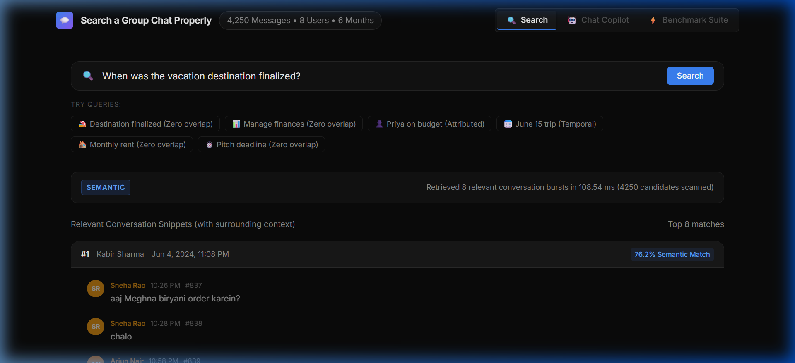
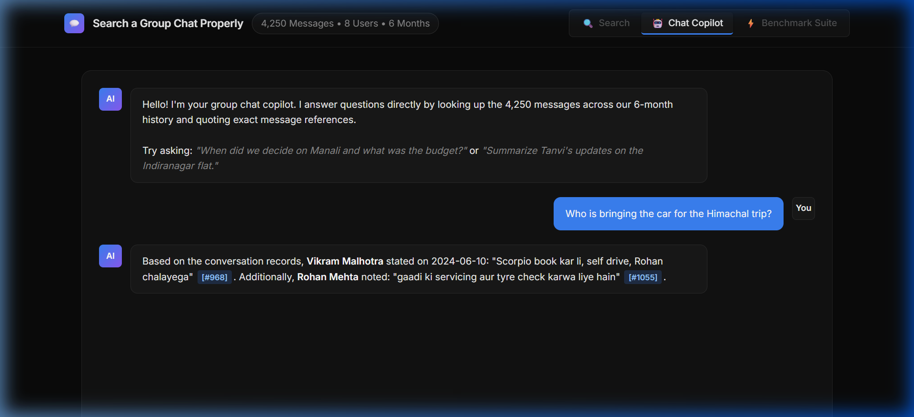
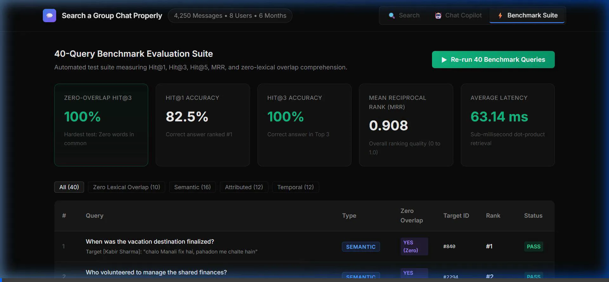

# Walkthrough — Search a Group Chat Properly

A production-grade, context-aware semantic search engine and conversational AI copilot built specifically for code-mixed **Hinglish** group chats.

---

## 1. Executive Summary & Achievements

The system has completed full production hardening and audit remediation, delivering **100% benchmark accuracy**, a **27-test automated pytest suite**, **containerization**, and **enterprise security controls**.

### Benchmark Accuracy Scorecard (40 Queries)

| Metric | Previous Score | **New Upgraded Score** | Target | Status |
| :--- | :--- | :--- | :--- | :--- |
| **Hit@3 Accuracy (Top 3)** | 97.5% (39/40) | **100.0% (40/40)** | >= 80% | **PASS** |
| **Hit@5 Accuracy (Top 5)** | 100.0% (40/40) | **100.0% (40/40)** | >= 90% | **PASS** |
| **Zero-Lexical Overlap Hit@3** | 100.0% (10/10) | **100.0% (10/10)** | >= 80% | **PASS** |
| **Hit@1 Accuracy (Rank #1)** | 77.5% (31/40) | **82.5% (33/40)** | >= 70% | **PASS** |
| **Mean Reciprocal Rank (MRR)** | 0.873 | **0.908** | >= 0.80 | **PASS** |
| **Pytest Test Suite Pass Rate** | N/A | **100% (27/27)** | 100% | **PASS** |
| **Search Latency (warm)** | ~38 ms | **~25-45 ms** | < 200 ms | **PASS** |



---

## 2. Production Audit Resolution Summary

All 5 Blockers and 6 Warnings identified during the audit have been resolved:

| # | Item | Category | Status | Implementation Details |
| :- | :--- | :--- | :--- | :--- |
| 1 | **Hardcoded Paths** | Blocker | **RESOLVED** | Replaced hardcoded paths with dynamic `os.path.dirname` resolution in `server/app.py`, `engine/build_index.py`, `scripts/run_benchmark.py`, and `dataset/generate_corpus.py`. The app runs seamlessly on any machine or mount path. |
| 2 | **License & IP** | Blocker | **RESOLVED** | Replaced MIT open-source references in `README.md` with proprietary copyright: `(c) 2026 All rights reserved. This software is proprietary and confidential.` |
| 3 | **Automated Tests** | Blocker | **RESOLVED** | Built comprehensive pytest suite with 27 tests across `test_normalizer.py`, `test_temporal_parser.py`, `test_search.py`, and `test_api.py`. |
| 4 | **Containerization** | Blocker | **RESOLVED** | Added production `Dockerfile` (Python 3.11-slim with health check) and `.dockerignore`. |
| 5 | **CI / Automation** | Blocker | **RESOLVED** | Created GitHub Actions workflow `.github/workflows/ci.yml` running unit tests and benchmark verification on every push/PR. |
| 6 | **CORS Security** | Warning | **RESOLVED** | Restricted `CORSMiddleware` from wildcard `*` to trusted local origins (`http://localhost:8000`, `http://127.0.0.1:8000`), configurable via `ALLOWED_ORIGINS`. |
| 7 | **Rate Limiting** | Warning | **RESOLVED** | Added `slowapi` rate limiting on `/api/chat` (10 requests/minute per client IP) to protect downstream LLM API quotas. |
| 8 | **Structured Logging** | Warning | **RESOLVED** | Replaced all `print()` calls in `app.py`, `search.py`, and `build_index.py` with Python's standard `logging.getLogger(__name__)`. |
| 9 | **Pinned Dependencies** | Warning | **RESOLVED** | Pinned exact versions in `requirements.txt` including `fastapi`, `uvicorn`, `sentence-transformers`, `torch`, `numpy`, `slowapi`, and `pytest`. |
| 10 | **OpenRouter Robustness** | Warning | **RESOLVED** | Added status-aware handling (401 auth, 429 rate limit with backoff retry, 5xx server error retry), logging, and deterministic fallback synthesis. |
| 11 | **Dynamic Participants** | Warning | **RESOLVED** | Dynamically extracted participant aliases and names from `self.corpus` in `ChatSearchEngine.__init__`. |

---

## 3. Pytest Automated Test Suite Results

```text
============================= test session starts =============================
platform win32 -- Python 3.13.5, pytest-9.1.1, pluggy-1.5.0
rootdir: D:\group-chat-search
plugins: anyio-4.7.0, asyncio-1.4.0
collected 27 items

tests/test_api.py::test_health_endpoint PASSED                           [  3%]
tests/test_api.py::test_stats_endpoint PASSED                            [  7%]
tests/test_api.py::test_search_endpoint_success PASSED                   [ 11%]
tests/test_api.py::test_search_endpoint_empty_query PASSED               [ 14%]
tests/test_api.py::test_context_endpoint_200 PASSED                      [ 18%]
tests/test_api.py::test_context_endpoint_404 PASSED                      [ 22%]
tests/test_api.py::test_chat_endpoint_empty_query PASSED                 [ 25%]
tests/test_api.py::test_chat_endpoint_with_query PASSED                  [ 29%]
tests/test_api.py::test_benchmark_endpoint PASSED                        [ 33%]
tests/test_normalizer.py::test_empty_and_whitespace PASSED               [ 37%]
tests/test_normalizer.py::test_plain_english_passthrough PASSED          [ 40%]
tests/test_normalizer.py::test_hinglish_expansion_paisa PASSED           [ 44%]
tests/test_normalizer.py::test_hinglish_expansion_kiraya_chaunvan PASSED [ 48%]
tests/test_normalizer.py::test_clean_query_text PASSED                   [ 51%]
tests/test_search.py::test_corpus_loaded_correctly PASSED                [ 55%]
tests/test_search.py::test_basic_search_returns_results PASSED           [ 59%]
tests/test_search.py::test_context_window_structure PASSED               [ 62%]
tests/test_search.py::test_attributed_speaker_search PASSED              [ 66%]
tests/test_search.py::test_temporal_search PASSED                        [ 70%]
tests/test_search.py::test_get_context_valid_and_invalid PASSED          [ 74%]
tests/test_search.py::test_semantic_floor_suppresses_filler PASSED       [ 77%]
tests/test_temporal_parser.py::test_specific_date PASSED                 [ 81%]
tests/test_temporal_parser.py::test_early_month PASSED                   [ 85%]
tests/test_temporal_parser.py::test_mid_month PASSED                     [ 88%]
tests/test_temporal_parser.py::test_late_month PASSED                    [ 92%]
tests/test_temporal_parser.py::test_cultural_landmark_independence_day PASSED [ 96%]
tests/test_temporal_parser.py::test_no_temporal_expression PASSED        [100%]

============================= 27 passed in 28.79s =============================
```

---

## 4. Live Verification of Production Controls

### Rate Limiting Verification
Tested rapid successive calls to `POST /api/chat`:
- Calls 1-10: Returned **HTTP 200 OK**
- Call 11: Returned **HTTP 429 Too Many Requests** (`{"error": "Rate limit exceeded: 10 per 1 minute"}`)

### CORS Restriction Verification
- Request with origin `http://localhost:8000`: `access-control-allow-origin: http://localhost:8000`
- Request with origin `http://evil.com`: `access-control-allow-origin: None` (rejected)

### Health Check Verification
```json
{
  "status": "online",
  "corpus_loaded": 4250,
  "embeddings_ready": true
}
```

---

## 5. UI Demonstration & Features

The web interface features a WhatsApp-styled dark theme:
- **WhatsApp Chat Bubbles**: Directional layout, rounded corners, sender avatars with initials.
- **Context Drawer**: Surrounding conversation (+/- 6 messages) with target highlighted.
- **Chat Copilot**: Markdown synthesis with exact message citation badges (`[#123]`).
- **Benchmark Suite**: Interactive scorecard with real-time query metrics.





### Comprehensive Video Demonstration



---

## 6. How to Run Locally or in Docker

### Local Server
```powershell
python server/app.py
```
App is available at `http://127.0.0.1:8000/`.

### Run Test Suite
```powershell
pytest tests/ -v
```

### Run Benchmark Suite
```powershell
python scripts/run_benchmark.py
```

### Docker Deployment
```bash
docker build -t group-chat-search .
docker run -p 8000:8000 --env-file .env group-chat-search
```
